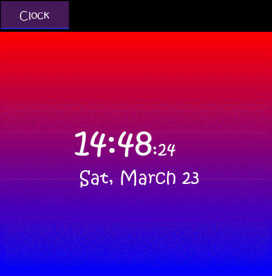

# Simple Clock :alarm_clock:
Hi everybody :wave:

Hope you doing well :blush:

This project is a simple and beautiful clock app :alarm_clock: developed with `kivy` framework in `python` for Desktop/Mobile devices.


## Platforms :iphone::computer:
Windows, macOS, Linux, Android, IOS

## Requirements :clipboard::heavy_check_mark:
After cloning the repo, run the following command to install prerequisite libraries:

```
pip3 install kivy
```

If pip3 is not install then run the following command:

```
sudo apt install python3-pip
```

## Copyright :copyright:
:warning: You should mention the Developer in any kind of usage of this project.

## Screenshots 📷



## Contact Developer :link:
<p align="left">
  <a href="https://www.facebook.com/bazzazi" target="_blank" rel="noreferrer"> </a>
  <a href="http://www.instagram.com/bazzazi" target="_blank" rel="noreferrer">  </a>
  <a href="https://www.linkedin.com/in/bazzazi/" target="_blank" rel="noreferrer"></a>
  <a href="https://www.stackoverflow.com/users/22125953" target="_blank" rel="noreferrer"> </a>
  <a href="https://www.youtube.com/@bazzazi" target="_blank" rel="noreferrer">  </a>
</p>